<link href="/tutorials/assets/westli_md_styles.css" rel="stylesheet"></link>

# Computer Vision for _FIRST_ Robotics

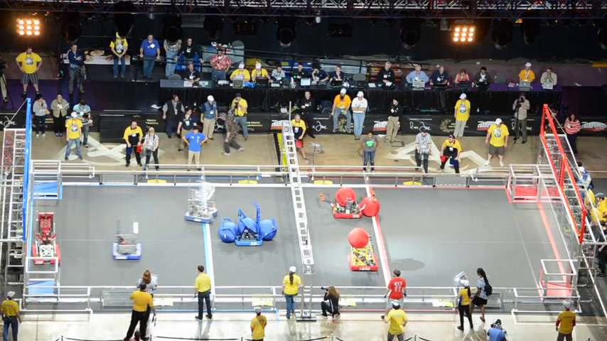

### Aims

* Learn to do basic Computer Vision (CV) operations
* Develop a system for intelligent analysis of a scene
* Learn how to find the resources to develop further CV skills

### Resources
*  [OpenCV tutorials](https://docs.opencv.org/3.0-beta/doc/py_tutorials/py_tutorials.html)
*  [PyCharm IDE](https://www.jetbrains.com/pycharm/) or OCVID (if ready)   
*   Aerial Assist Final footage.

### Overview
1.  Learn how to load and view images and frames from a video
2.  Understand the structure of images through basic operations (grayscale etc)
3.  ROI selection
4.  Basic colour segmentation
5.  Basic shape detection
6.  Object tracking
7.  Score detection!

### Interdisciplinary opportunities
None…?

***

## Introduction

### What is Computer Vision?

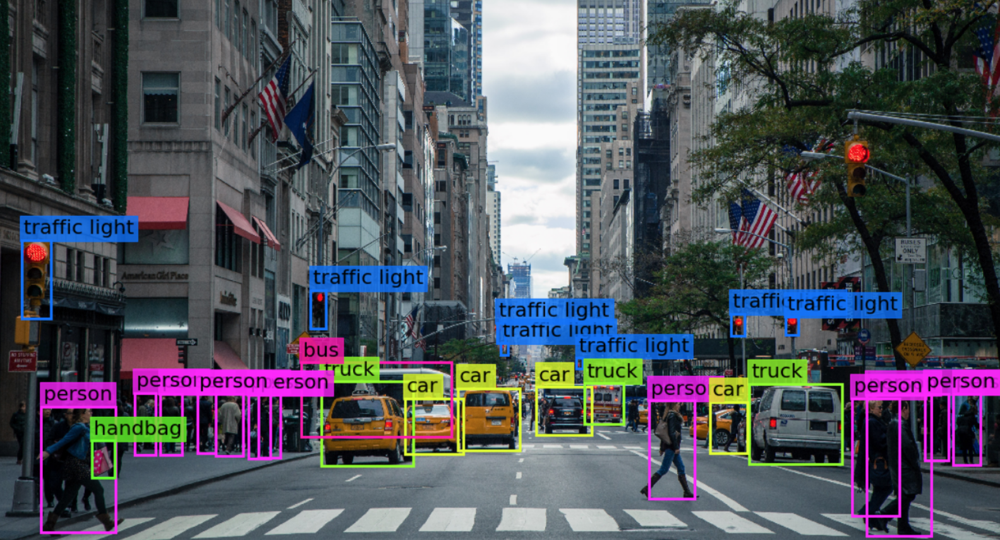

One of the main ways humans can tell what’s happening around them is through sight, and it’s one of the most useful (but difficult) tools for a computer to use. Robotics in particular relies heavily on vision to interact appropriately with the world.

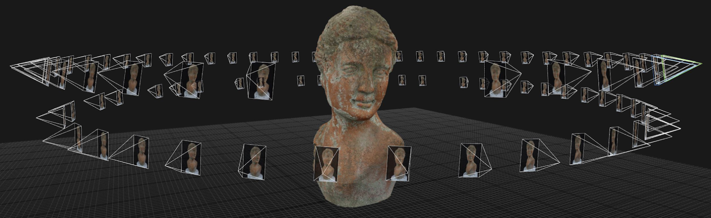

Specifically, Computer Vision is a discipline within computer science which concerns itself with algorithms to derive meaning from camera inputs, and includes powerful techniques like image classification (understanding what’s in a photo), photogrammetry (constructing 3d scenes from multiple images), facial recognition, and many more.


#### What is OpenCV?

In the same way that engineers use off-the-shelf parts rather than machining them from scratch, programmers use pre-built libraries to shortcut the difficult task of implementing tools from scratch. OpenCV is a publicly available library designed to make computer vision quick and easy, and is both well documented and heavily used. OpenCV is available with C++, Python and Java bindings, but for this tutorial we will be using Python, since it makes very simple code.

Throughout this tutorial, you can find more information on any topic in the footnotes, or do your own search - some great resources can be found in the [opencv python tutorials](https://opencv-python-tutroals.readthedocs.io/en/latest/py_tutorials/py_tutorials.html)


### Why are we doing this?
_FIRST_ Robotics Competition encourages students to develop cutting-edge robotics, but a robot without sensing and processing is little more than a remote controlled car. Integrating computer vision in your robot makes it far more effective on the field, and can help the robot make decisions when the driver can’t see well or react quickly enough.

There are many things a robot with computer vision can do, including (but not limited to):

-   Goal & game element identification
-   Visual servoing (automatically reaching a target)
-   Auto-aim
-   Auto-align
-   Field mapping

### OK, what do I do?
The following steps will take you through the techniques to achieve a complex computer vision task, building up advanced algorithms using basic building blocks. Follow along with the steps, making sure you write out all provided code and explore options wherever possible. Throughout the process, keep in mind what else you could use each concept for. Also, make sure to comment your code as required to help jog your memory later, and continually save and back up your code using Git by following the prompts -- that way, you can refer back to the code in future whenever you have to do a similar task, since you already have working code!

**Note:** For the duration of this tutorial, the code will be explained in detail but I will assume you have some knowledge about python programming; if you have never used it before, you will have a slightly harder time understanding what is happening. If you want to quickly pick up some basics to make it easier to read, I recommend flicking through the [Codecademy tutorial](https://www.codecademy.com/learn/learn-python-3). This is a free interactive tutorial that covers basic syntax, although you will have to create an account.
## Setup

### How do I get started?

There are a few things you have to do to set up this project. It will take a little while, but these steps apply to any project you might want to do in the future - setting up the git repository and development environment properly is worth putting time into, since it makes everything else easier.

### Set up Git

As a programmer, you should get into the habit of using Git for all your projects. This gives you a cloud based backup of your code so you can always access it, and creates a history of code -- like the ultimate Ctrl+Z!

Throughout this tutorial, you will see prompts to help you keep up your git repository. If you follow these carefully, your git repository will be set up well and your code will be saved for later use! Make sure you read the descriptions of what you’re doing whenever a new command is introduced, so you know what’s going on.

To start with, go to [https://github.com/new](https://github.com/new) and either sign in to github (if you have an account) or create a new account. Github is a free online code hosting platform which is extremely handy for programmers. Once you’ve signed in, you should see the below screen; make sure you give it a good name, description and tick the box for a README, then click “Create repository”.

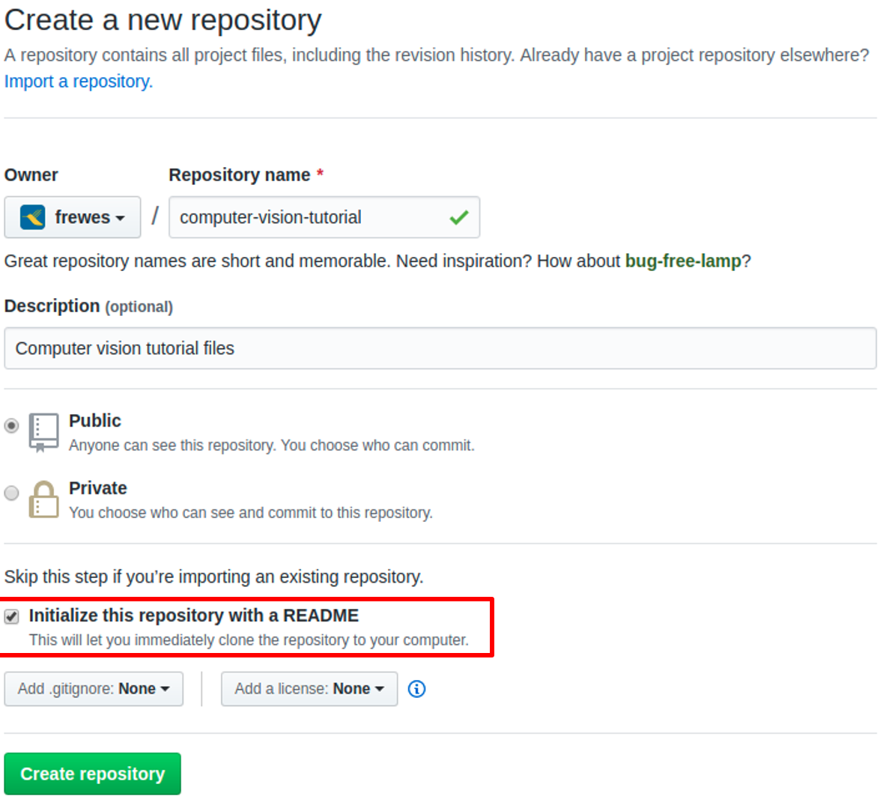

Once you’ve created your repository online, you want to create a local copy where you can edit your code. To interact with Git locally, you have to install Git on your computer; just go to [https://git-scm.com/book/en/v2/Getting-Started-Installing-Git](https://git-scm.com/book/en/v2/Getting-Started-Installing-Git) and follow the instructions for your operating system. You’ll then have access to terminal commands for interacting with git - on Windows, this is called “git bash”, while on Linux and Mac you can type these commands directly into the terminal.

```bash
git clone https://github.com/<username>/computer-vision-tutorial
git status 
```
> On windows, shift-rightclick in the directory you want the project in, and select “open git bash here”. ( Otherwise open the terminal and navigate to the directory ).
> You run all git commands by typing “git” followed by a particular command -- type “git help” to see all of them. To understand them better, google is your friend!


### Install Python and IDE

One of the things you’ll need to follow this tutorial (of course) is the Python programming language. If you do not already have it on your computer, go to [https://www.python.org/downloads/](https://www.python.org/downloads/) and get the latest version.

You can develop python code using any approach you could use to write a text file, but it’s a lot easier if you have an Integrated Development Environment (IDE) - this is a program which helps you write and run code easily. For python, there are many options for this, but I recommend Jetbrains PyCharm; you can get a free version from [https://www.jetbrains.com/pycharm/](https://www.jetbrains.com/pycharm/). Other IDEs that work include Microsoft Studio Code, Anaconda Spyder, or Python IDLE, and a quick google search will find a dozen more, so it’s easy to find one that suits your taste.

Open up your IDE and create a file called `main.py`; inside this file, type this line:

```python
print("Hello, Python!")
```

main.py

Then, use your IDE to run this file, and you should see the phrase appear in a console window. If not, you’ll need to figure out why, since your python needs to be set up correctly to run this tutorial.

### Add requirements

The key feature of Python is the abundance of libraries available for development, including OpenCV.  In order to define and install the libraries we need here, create a file in your project directory called “requirements.txt”, and fill it with this content:

```python
python-opencv
numpy
```
requirements.txt

Most python IDEs have a way to handle this file; if you’re using PyCharm, go to <https://www.jetbrains.com/help/pycharm/managing-dependencies.html> and follow the instructions for how to load the libraries, otherwise google your IDE to find out how to handle the requirements file properly. 

```bash
git status
git add main.py requirements.py
git commit -m"Started project, defined requirements"
git push
```

> Saving changes in git requires three separate steps:
>
> * “add” tells git which files you want to save.  “git add .” adds all changes.
> *  “commit” is the actual save - it creates a checkpoint with a description for later.
>
> *  “push” uploads all your commits to github


### Preparing the task

The task we’ll be building up to in this tutorial is to automatically score an FRC match - specifically, the final Einstein match from the 2014 game, Aerial Assist.

In this game, points were scored when the game elements were thrown into the goals at either end of the field, tossed over the central truss, or passed between robots.


To prepare, you’ll need an image and a video file to test with; please download files from <ADD LINK> and <ADD LINK>, and copy them into your project directory.

```bash
git add AA.png AA.mp4
git commit -m"Added data files"
git push
```

> In this case, we’re committing the data files; however, you should generally avoid putting data in your git repository, as large files can fill up your git repo very fast.
>
> We’re doing it here because the files aren’t huge and for demonstration purposes.

OK, you’re now ready to write some code!

## OpenCV basics

Obviously, the most important thing you have to be able to do when working with images is open and view images.  

Open the main.py file and add these lines:

```python
import cv2

frame = cv2.imread("AA.png")
cv2.imshow("output", frame)
cv2.waitKey(0)
```

main.py

What does this code do?

- `import cv2`: brings in the opencv library into your code, allowing it to be used.  Now, all the functions available in the opencv python bindings can be accessed using “cv2.”  Throughout this tutorial, this line should always be at the top of your code.
- `frame = cv2.imread (“AA.png”)`: reads the specified file and stores it in the “frame” variable as an array.
- `cv2.imshow(“output”, frame)`: opens up a window for you to see the image you provide it.  `“output”` is the title of the window.
- `cv2.waitKey(0)`: This line tells the code to wait until you press a key before moving on; if you don’t do this, the frame will disappear immediately after opening.  If you change the `0` to any other positive number, it will wait that many milliseconds before moving on if you don’t press a button.

OK, looking at pictures is one thing, but videos are really where it’s at.  Videos allow you to test a lot of images very quickly, and even use the time between frames to make decisions.

To open and view a video, change the code to the following:

```python
import cv2

cap = cv2.VideoCapture('AA.mp4')

while(True):
    # Capture frame-by-frame
    _, frame = cap.read()
    # Display the resulting frame
    cv2.imshow("output", frame)
```

main.py

In this code, we see the “VideoCapture” object -- once created, you can read one frame at a time using the `cap.read()` function.

Notice that this time round, we don’t need the `cv2.waitKey` function, since we don’t actually want it to pause after every frame.  However, we want some basic control of the video playback, so add the following lines:

```python
...
	cv2.imshow("output", ret)
    key = cv2.waitKey(1)
    if key & 0xFF ord('p'):
		key = cv2.waitKey(0)
	if key & 0xFF == ord('q'):
		break
```

main.py

There are simpler ways to do this, but this code gives you a “pause” key (p) and a “quit” key (q), so you can freeze on a frame or end the program.

Note the `waitKey(1)` here - as described above, this tells the code to wait for 1ms before moving on.  If you make this number bigger, the video will run slower, which might be helpful so you can see each frame more clearly.

```bash
git add main.py
git commit -m"Implemented basic read/show"
git push
```

> Doing these steps regularly might begin to feel tedious, but it’s absolutely worth doing every time you finish a step, as this allows you to return to this stage in your project whenever you want.  I will suggest times to do this throughout, but feel free to do it more often - just make sure you always write a descriptive message.

### Basic operations

> ### Sidenote!
> One thing you need to wrap your head around is how Python sees your image.
> The image below demonstrates how the image is represented digitally - it’s stored as a matrix of 8 bit integers (0-255, whole numbers) which represent the brightness of each point in the image (pixel).  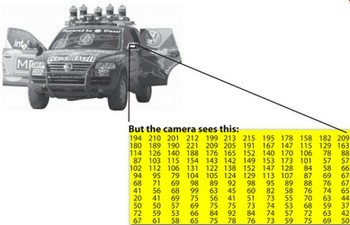
>
> It gets a little bit more complicated for colour images, but not much - instead of a single number, each pixel is then represented by a triplet of 8 bit integers, e.g. (255, 0, 127).  Each number represents the brightness of one component of colour in that pixel.  By default, OpenCV uses BGR colour format, which means the first number represents Blue, the second represents Green and the third represents Red.  What colour does the example triplet represent?

Just viewing images is not very useful - let’s start changing them now!

The first thing we’ll do is add an annotation to the picture - putting some text in the corner.  Add the below line to your main.py; can you figure out where to place the line?  Keep in mind that the frame has to be defined, and it will only have the annotation after this line runs.

```python
cv2.putText(frame, 'Hello!', (10,50), cv2.FONT_HERSHEY_SIMPLEX, 2, (255,255,0), 8)
```

main.py

This line is a little complicated, but have a play with the different parameters:

- The third parameter [(10,50)] is the location in the image of the bottom left corner of the text.
- The fourth parameter is the font face - if your IDE has python autocomplete, type “cv2.FONT_” and see what it suggests!
- The fifth parameter (2) is the scale of the text (it’s actually a scale multiplier applied to the “base size” of the given font.
- The sixth parameter is the font colour, defined as a BGR triplet as described above.
- The seventh parameter is the thickness of the lines used to draw the text


Hopefully, you figured out where that line should go.  However, as we move forward and add many more operations, it can get a lot more complicated to figure out.  So before we move on, let’s restructure our code to make it easier to extend by separating it into functions:


```python
import cv2

def processFrame(frame):
    ret = addAnnotation(frame)
    return ret

def addAnnotation(frame):
   cv2.putText(frame, 'Hello!', (10,50), cv2.FONT_HERSHEY_SIMPLEX, 2, (255,255,0), 8)
   return frame

cap = cv2.VideoCapture('AA.mp4')

while(True):
   # Capture frame-by-frame
   _, frame = cap.read()
   ret = processFrame(frame)
   # Display the resulting frame
   cv2.imshow('output',ret)
   key = cv2.waitKey(1)
   if key & 0xFF ord('p'):
       key = cv2.waitKey(0)
   if key & 0xFF == ord('q'):
       break
```

main.py

So, the “main” part of the code (the part which is actually run) is at the bottom, with no indent; we shouldn’t have to change this part from now on.  Instead, we’ll change the “processFrame” function - we just have to make sure that function always returns an OpenCV image.  

```bash
git add main.py
git commit -m"Restructured code"
git push
```


Now, let's convert the image to grayscale.

```python
def processFrame(frame):
    ret = BGRtoGrayscale(frame)
    return ret

def BGRtoGrayscale(frame):
    return cv2.cvtColor(frame, cv2.COLOR_BGR2GRAY)
```

main.py

The image you see should now be in black and white instead of colour!


Due to the way we've structured our code, we can combine multiple functions in `processFrame`:

```python
def processFrame(frame):
    gray = BGRtoGrayscale(frame)
    ret = addAnnotation(gray)
    return ret
```

main.py

You should notice that when you run this code, the output frame does **not** have a coloured annotation - because you add the annotation to a grayscale image, the colour is converted to grayscale before OpenCV draws the text.  In order to draw coloured text on a grayscale image (or, any coloured shape, as you'll see later), you have to first convert the grayscale back into colour:

```python
def processFrame(frame):
    gray = BGRtoGrayscale(frame)
    bgr = GrayscaleToBGR(gray)
    ret = addAnnotation(bgr)
    return ret

def GrayscaleToBGR(gray):
	return cv2.cvtColor(frame, cv2.COLOR_GRAY2BGR)
```
main.py


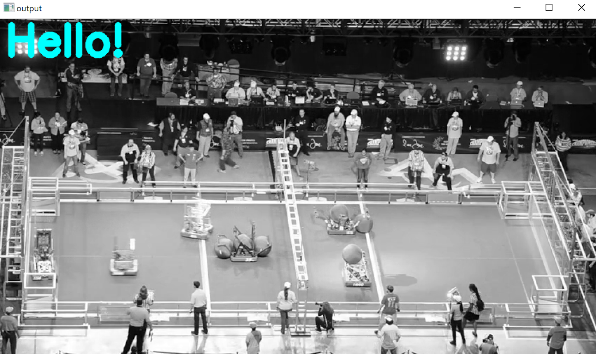

What's the point of doing this?  Just to get some practice manipulating images in OpenCV.  Later we'll see other colour spaces that are more useful.

```bash
git add main.py
git commit -m"Added grayscale and annotations"
git push
```

## Region of Interest

The video we're using includes a lot of content which is not useful to us - tracking the people in the background won't help calculate the score!

However, the camera is fixed, so the part of the image we care about (i.e. the field) is always in the same place.  So, what we can do is define a so-called <abbr title="Region (or Rectangle) of Interest">ROI</abbr>[^roi].  By doing this, we can tell OpenCV which part of the image we care about.

<div class="alert info" markdown='1'>
    <strong>How could I use this for robotics?</strong>
	<p>
		Onboard cameras can often see things that aren't helpful (e.g. parts of the robot).  By defining an ROI, you can ignore such things safely.
    </p>
</div>
### Rectangular

```python
import cv2
import numpy as np

def processFrame(frame):
   field = rectROI(frame)
   return field

def rectROI(frame):
   ret = frame[200:450,20:800]
   return ret
```

main.py

What's happening here? 

This uses a very simple approach for ROI extraction; we simply define a variable called `ret` which gets all the data from `frame`, but only between rows 200 and 450, and columns 20 to 800. 

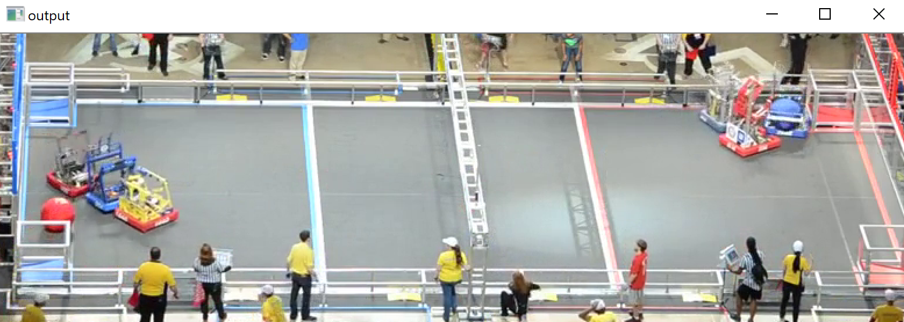

Obviously, this is a very simple approach, and it can work very well.  However, there are two potential issues for our use case:

* Our view of the field is not actually rectangular
* Due to perspective, the ball can actually jump out of this rectangle; we may want to track it above the truss without including all those rows.

The solution to this problem is to use a more complex shape for the contour.

### Concave

We define a complex ROI using a _contour_ - in this case, a boundary around the field.  In OpenCV, a contour is defined by a list of _vertices_ that fall on the perimeter of the shape you wish to define.  Add the following function to your code to see how it works:

```python
def isolateField(frame):
   mask = np.zeros(frame.shape, dtype=np.uint8)
   roi_corners = np.array([[(0,200), (800,200), (850, 455), (20,450)]])
   cv2.fillPoly(mask, roi_corners, (255,255,255))
   #cv2.imshow('mask',mask) # If you want to see what the mask looks like...
   #cv2.waitKey(0)
   ret = cv2.bitwise_and(frame, mask)
   return ret
```

main.py

* `mask=np.zeros(...)` creates a black picture with the same shape as the original frame. 
* `roi_corners = np.array([[...]])` defines a two-dimensional "numpy array"; what we're actually creating is a list of contours, where each contour is a list of points.
* `cv2.fillPoly` fills the given shapes with the given colour; in this case, we fill the entire shape with white, creating a black-and-white mask image.  Try using `cv2.imshow` to see what this mask looks like.
* `cv2.bitwise_and(frame,mask)` creates a new image such that every black pixel in `mask` stays black, while every white pixel becomes the same colour as the corresponding pixel in `frame`.

If you set up the `processFrame` function correctly, you should get the following output:


Now, have a play with the vertices of the contour to improve the shape of the ROI; you can add as many points as you want to cut out undesirable sections of the input frame.

**NOTE**: When defining corner points, you have to make sure they're defined in order, or you can end up with some really weird results:

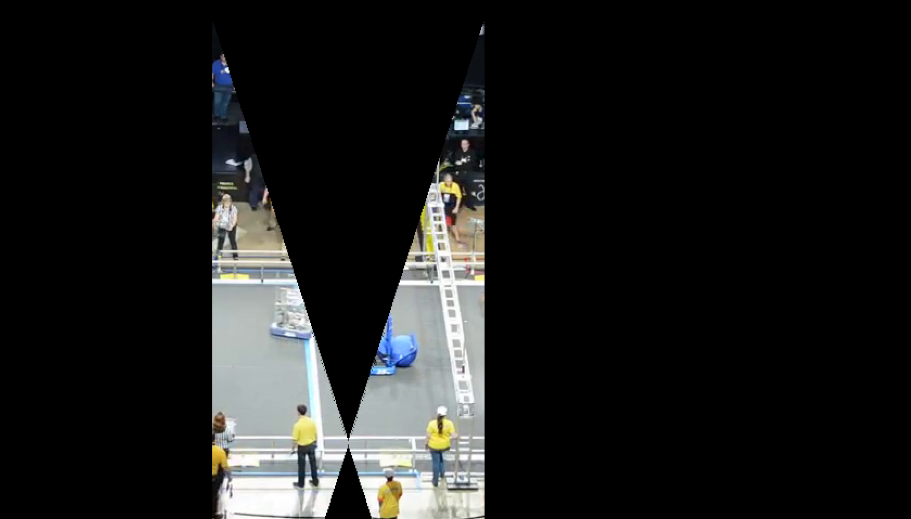


```bash
git add main.py
git commit -m"Added a ROI mask"
git push
```


## Colour segmentation

Now, in order to count scoring events during the match, we have to know where the game elements are.  In this case, there are two types - blue and red balls.  One of the ways we can find them is to do "colour segmentation[^colour]" - extract only the red or blue parts of the image.

### RGB segmentation

The most common representation of colour you'll find is the RGB colour space.  This colour space is linear and three-dimensional, as shown below. 


In this space, we can identify a particular shade by defining a volume within this cube, which is pretty straightforward if you're looking for one of the three primary colours. 

In this case, if we want the blue component to be high (e.g. 200-255) but the other two should be low (< 200).  This will capture mostly colours which are mostly blue.  Remember also that in OpenCV, the default colour space is BGR, not RGB; the theory is the same though!

We'll implement this in a similar way to the concave ROI extraction: we'll create a black-and-white mask image and do a `bitwise_and`.  However, the format of the `bitwise_and` operation is slightly different this time.

```python
def findBlue(frame):
   lower = np.array([200,0,0])
   upper = np.array([255,200,200])
   mask = cv2.inRange(frame, lower, upper)
   ret = cv2.bitwise_and(frame, frame, mask=mask)
   return ret
```

main.py

`lower` and `upper` are opposite corners of a rectangular prism within the RGB cube.  When we put these values into `cv2.inRange`, we create a mask the same shape as `frame`, with all pixels in the defined range as white and everything else as black.

Make sure you add the `findBlue` function to `processFrame` to see an output like the one below; feel free to play with the values to get a cleaner output.

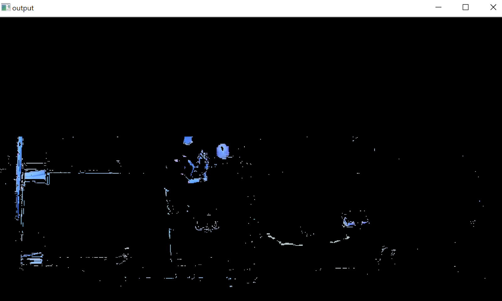

There are some issues with this approach - for instance, dark blue is actually represented with values outside our threshold (e.g. 0,0,100 is a dark blue).  Defining a robust threshold in the RGB space can be very difficult. 

### HSV Segmentation

There are other colour spaces which are easier to work with than RGB; a very common one is <abbr title="Hue, Saturation, Value">HSV</abbr>.  Unlike the RGB colour space, the HSV space is cylindrical, though it too can represent all possible colours.  It's also composed of three separate values:

* **Hue** represents the colour's position on the rainbow.
* **Saturation** represents how intense the colour is.
* **Value** represents the brightness of the colour.

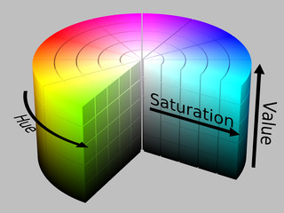

Hopefully, this diagram illustrates how you can identify a particular colour; by taking a slice from this cylinder, you can represent any shade of "blue" including bright, light or dark.

In this case, we can get a decent blue value using the values (80,100,0) and (120,255,255) as lower and upper thresholds respectively.

To implement this in your `findBlue` function, all you have to do is convert the frame to the HSV colour space, in the same way we converted to grayscale earlier:

```python
hsv = cv2.cvtColor(frame, cv2.COLOR_BGR2HSV)
```

main.py (findBlue)

Remember you also have to reference `hsv` in the `inRange` function to create the mask.

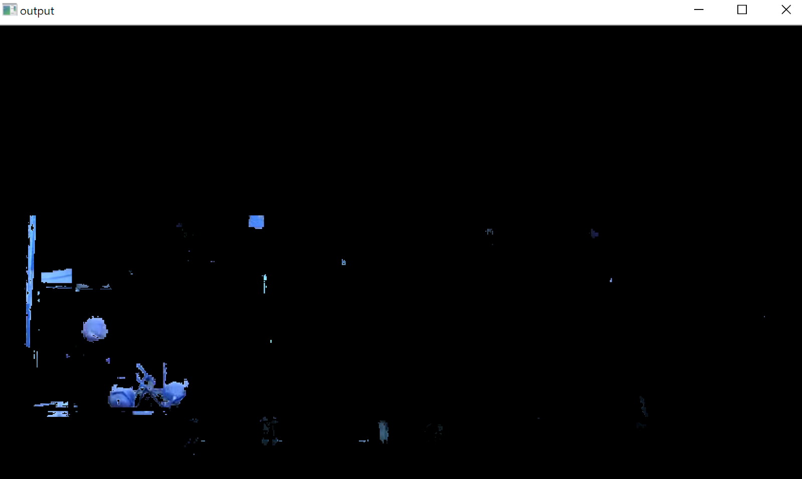

Notice how the result of `findBlue` in HSV is a little cleaner and more accurately captures blue shades.  Of course, you can get RGB thresholding to work just as well, but HSV typically makes it easier to pick out a particular colour.  Feel free to use either method moving forward.

There is one issue with using the HSV space, as you'll find if you try to make a corresponding `findRed` function: red shades span the "break" in the cylinder; some red shades are defined from `hue = 0` up, while others are defined up to `hue = 255`.

So, in this case, we have to create two separate masks and combine them:

  ```python
def findRed(frame):
   hsv = cv2.cvtColor(frame, cv2.COLOR_BGR2HSV)
   lower = np.array([0,100,0])
   upper = np.array([10,255,255])
   mask1 = cv2.inRange(hsv, lower, upper)
   lower = np.array([180,100,0])
   upper = np.array([255,255,255])
   mask2 = cv2.inRange(hsv, lower, upper)
   mask = mask1 + mask2
   ret = cv2.bitwise_and(frame, frame, mask=mask)
   return ret
  ```

main.py

As you can see, you can combine separate masks just by addition, if they're the same shape and number format.

One thing to notice as well is that `bitwise_and` uses `frame` rather than `hsv`; this is because the `imshow` function used later expects a BGR format - if you return an HSV image, you'll notice the colours look strange.

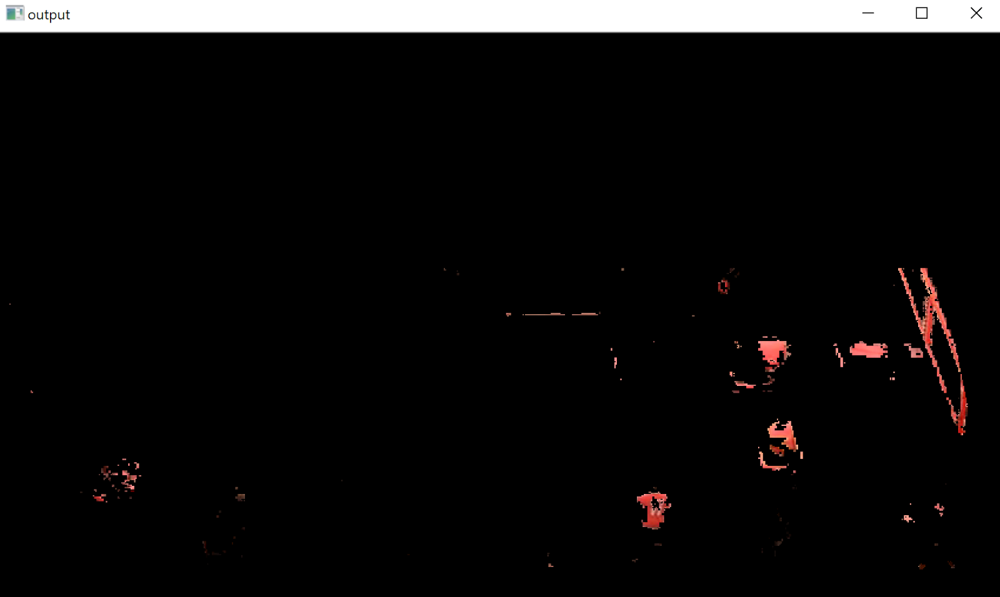

```bash
git add main.py
git commit -m"Added colour segmentation"
git push
```

### Morphological operators

One thing that you might notice about the colour masks is that the shapes are a little spotty.  By playing with the threshold values, you may be able to improve them; however, there are a few other methods we can use, called _morphological operators_[^morph].

One operator is called **erode**; as the name suggests, it chips away at the mask.  This can be great for getting rid of "noise" (small bits of mask you don't want).

```python
def erode(frame, size, iter):
   kernel = np.ones((size,size),np.uint8)
   return cv2.erode(frame,kernel,iterations = iter)
```

main.py

The way morphological operators work is quite mathematically complex, but the key elements to control are those defined in the function:

* `iter` controls how many times the erosion is performed, and
* `size` controls how much is eroded each time

Test out what happens to your mask when you run `erode` on it with different values!

Another operator is called **dilate**, and it's the opposite of erosion - it grows the mask, filling out holes in shapes and smoothing things.

```python
def dilate(frame, size, iter):
   kernel = np.ones((size,size),np.uint8)
   return cv2.dilate(frame,kernel,iterations = iter)
```

main.py

By combining these two operations, we can achieve even more useful behaviours.  A morphological **open** is defined by erosion followed by dilation, and removes noise without shrinking non-noise objects.  A morphological **close** is a dilation followed by an erosion, and is used to close small holes inside objects.

Test out any and all operators to improve the quality of your `findBlue` and `findRed` functions.  Keep in mind though that these operations only really make sense on binary images - if you try to run them on colour images you'll get some weird results.

With some cleaning up using morphological operators, you can get a much cleaner image:

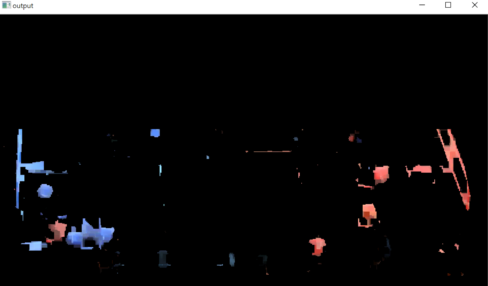

The above image was generated by combining multiple "find" functions:

```python
def processFrame(frame):
   field = isolateField(frame)
   red = findRed(field)
   blue = findBlue(field)
   return red+blue
```

main.py


```bash
git add main.py
git commit -m"Implemented morphological operators"
git push
```


## Shapes

Just extracting colours from an image is only a step in the process of locating particular objects; you also need to identify shapes with in the image.

### Hough Transforms

One useful tool for finding shapes (specifically, lines or circles) is the Hough Transform[^hough]. This is a mathematical construct which we can use to spot the balls after filtering them out:

```python
def findCircles(frame):
    gray = cv2.cvtColor(frame, cv2.COLOR_BGR2GRAY)
    circles = cv2.HoughCircles(gray, cv2.HOUGH_GRADIENT, 1,20, param1=50,param2=15,minRadius=10,maxRadius=30)
    listCirc = []
    if circles is not None:
        # loop over the (x, y) coordinates and radius of the circles
        for (x, y, r) in circles:
            # Check if circle is valid?
            listCirc.append((x,y,r))
    return listCirc

def drawCircles(frame,circles):
    ret = frame;
    for (x,y,r) in circles:
        cv2.circle(ret,(int(x),int(y)),int(r),(0,255,0),2)
    return ret
```

main.py

The `findCircles`  function defined above returns a list of all circles found in the frame, while the `drawCircles` function draws the circles on the frame so you can see them.

The `cv2.HoughCircles(...)` function has a lot of parameters - try changing them and seeing if you can improve the circle detection.  Just keep in mind that this function only works on grayscale images.

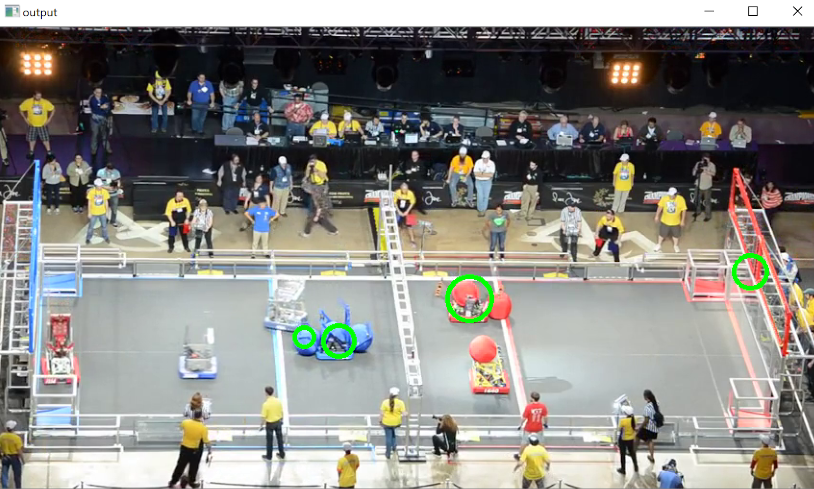

Now, you should understand why we did all the ROI and colour segmentation work; if you run `HoughCircles` on the raw frame, you'll probably see something like this:

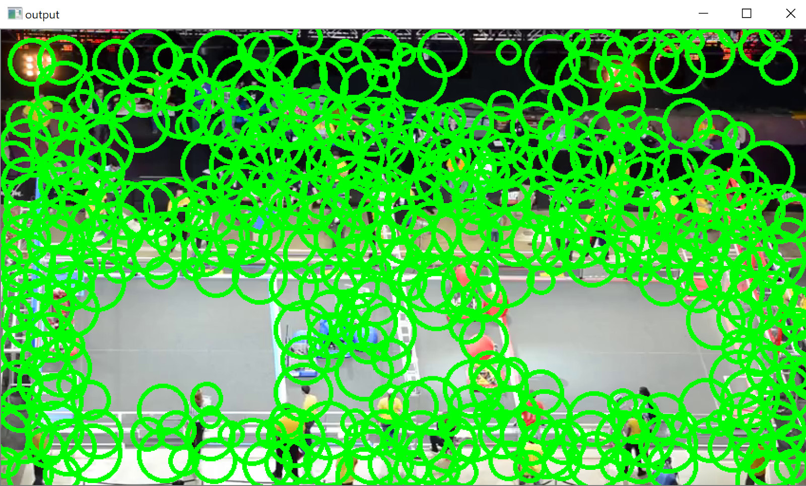

### Contours

Earlier, we defined contours by manually listing out points; however, if you've created a mask image using techniques like colour segmentation, OpenCV can create contours automatically[^contours]:

```python
def findCirclesByContours(frame, ref):
   gray = cv2.cvtColor(frame,cv2.COLOR_BGR2GRAY)
   _, thresh = cv2.threshold(gray,127,255,0)
   contours, hierarchy = cv2.findContours(thresh, cv2.RETR_TREE, cv2.CHAIN_APPROX_SIMPLE)
   ret = frame
   cv2.drawContours(retVal, contours, -1, (0,255,0), 3)
   return ret
```


Automated contour extraction only works on binary images, so we apply a `cv2.threshold` to turn a grayscale image into a binary one.  You can then use the `findContours` function to extract the outlines of all the white sections.

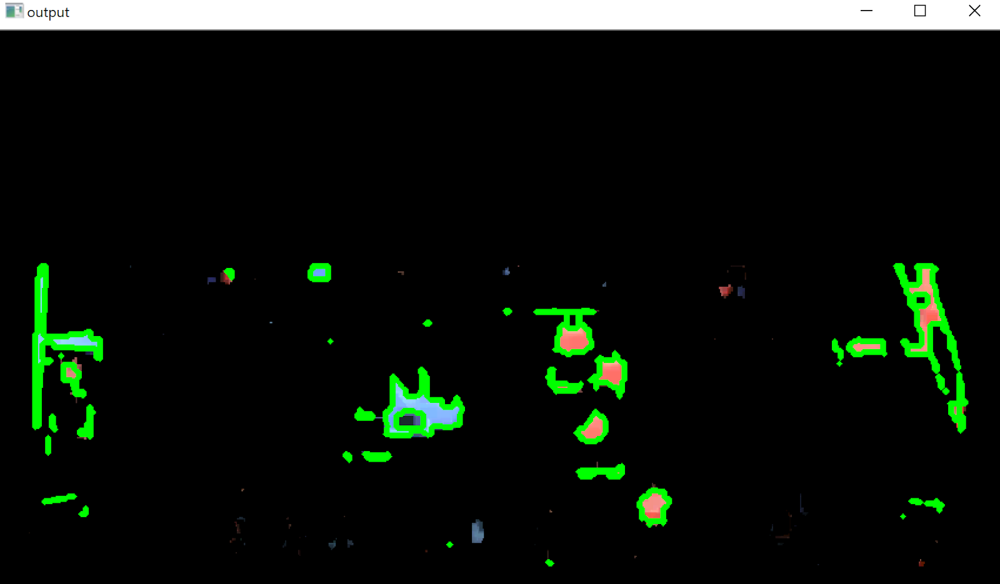

Finding raw contours is an incredibly useful technique because you can do a whole lot with them.  However, in this case we just want to find the ones that look like they represent circles.

OpenCV defines a function called `minEnclosingCircle` which represents the smallest circle required to surround the entire contour.  One way we can check if a contour is round is to compare the area enclosed by the contour to the area of the enclosing circle.

There are also thresholds on the size of the circle, since we know roughly how big the game elements are.

```python
def findCirclesByContours(frame):
    gray = cv2.cvtColor(frame,cv2.COLOR_BGR2GRAY)
    ret, thresh = cv2.threshold(gray,127,255,0)
    contours, hierarchy = cv2.findContours(thresh, cv2.RETR_TREE, cv2.CHAIN_APPROX_SIMPLE)
    circles = []
    for cnt in contours:
        (x,y),radius = cv2.minEnclosingCircle(cnt)
        center = (int(x),int(y))
        areaCircle = radius * radius * 3.14159
        areaContour = cv2.contourArea(cnt)
        if areaContour / areaCircle > 0.5 and radius > 10 and radius < 20:
            circles.append((x,y,radius))
    return circles
```

main.py

Can you think of any other ways to check if a contour is round?

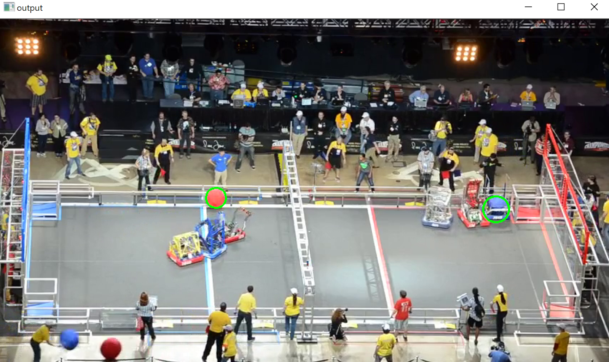


```bash
git add main.py
git commit -m"Detecting circles!"
git push
```


# ** TO BE CONTINUED**


[^roi]:  <https://stackoverflow.com/questions/51686454/creating-roi-mask-by-using-drawcontours-in-opencv>
[^colour]:  <https://www.learnopencv.com/invisibility-cloak-using-color-detection-and-segmentation-with-opencv/>
[^morph]: <https://docs.opencv.org/3.0-beta/doc/py_tutorials/py_imgproc/py_morphological_ops/py_morphological_ops.html>
[^hough]:  https://www.pyimagesearch.com/2014/07/21/detecting-circles-images-using-opencv-hough-circles/>
[^contours]:  <https://opencv-python-tutroals.readthedocs.io/en/latest/py_tutorials/py_imgproc/py_contours/py_contour_features/py_contour_features.html>


